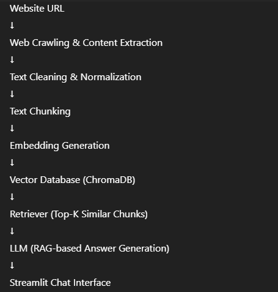

# Website-Based AI Chatbot using Embeddings

## Project Overview
This project is an AI-powered, website-specific chatbot designed to answer user questions **strictly based on the content of a provided website**.

The system takes a website URL as input, crawls and extracts meaningful textual content, converts it into embeddings, stores them in a vector database, and uses a Retrieval-Augmented Generation (RAG) pipeline to generate accurate, context-aware responses.

The chatbot is intentionally constrained to avoid hallucinations. If the required information is not available on the website, it returns a predefined fallback response.

---

## Key Features
- Accepts a website URL as input
- Crawls and extracts meaningful HTML content
- Removes headers, footers, navigation menus, and scripts
- Cleans and normalizes extracted text
- Splits content into semantic chunks
- Generates and persists embeddings
- Uses vector similarity search for retrieval
- Answers questions **only from website content**
- Session-level conversational memory
- Interactive Streamlit-based chat interface

---

## System Architecture

---

## Technology Stack

### Frontend / UI
- Streamlit

### AI Orchestration
- LangChain

### Embeddings
- SentenceTransformers (`all-MiniLM-L6-v2`)

### Vector Database
- ChromaDB (persistent local storage)

### Large Language Model (LLM)
- OpenAI GPT-based model (used for deployment)

---

## Why These Choices?

### Why SentenceTransformers?
- Lightweight and fast embedding generation
- Strong semantic similarity performance
- Suitable for real-time retrieval use cases

### Why ChromaDB?
- Simple setup with local persistence
- Ideal for small to medium-scale datasets
- No external vector database dependency required

### Why OpenAI LLM?
- Strong instruction-following capabilities
- Reliable performance for grounded question answering
- Easy integration with LangChain

---

## Grounding & Hallucination Control
The chatbot is explicitly instructed to:
- Generate answers **only from retrieved website content**
- Avoid using external or prior knowledge

If the answer is not found in the retrieved context, the system responds exactly with:
- The answer is not available on the provided website.
# website_humanli_chatbot
